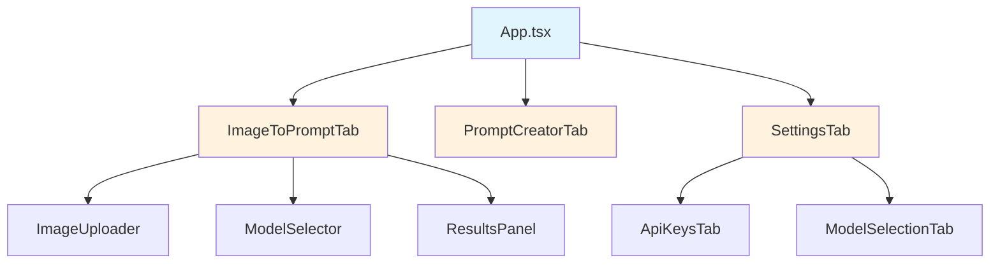

# Refactoring Sub-Issues (Part 3) - Issues T7-T12

## 🎫 SUB-ISSUE #T7: Extract Storage Layer to Separate Modules

### Title

```
SUB: Extract Storage Layer to Separate Modules (Category: Modularity)
```

### Body

````markdown
## Why (quantified)

**Current State**:

- `src/lib/storage.ts`: **723 lines** (exceeds 500 LOC guideline, near 400 P0 limit)
- **Multiple responsibilities** in single file:
  - Settings management
  - Pub/sub subscription system
  - Cross-tab synchronization
  - Deep equality checking
  - Debounced writes
- **High complexity** - difficult to maintain and test

**Related Storage Files**:

- `src/lib/historyStorage.ts`
- `src/lib/imageStorage.ts`
- `src/lib/bestPracticesStorage.ts`
- `src/lib/promptCreatorStorage.ts`
- `src/lib/ratingStorage.ts`

**Impact**:

- High cognitive load for changes
- Difficult to isolate testing concerns
- Potential for circular dependencies
- Merge conflict risk

---

## Plan (small, reversible)

### Phase 1: Extract Core Storage Utilities

- [ ] **Step 1.1**: Create base storage interface
  - Create: `src/lib/storage/types.ts`
  - Export: `StorageAdapter`, `SubscriptionManager` interfaces
  - ~50 LOC

- [ ] **Step 1.2**: Extract pub/sub system
  - Create: `src/lib/storage/subscription.ts`
  - Move: Subscription management logic from `storage.ts`
  - ~150 LOC

- [ ] **Step 1.3**: Extract cross-tab sync
  - Create: `src/lib/storage/crossTabSync.ts`
  - Move: Storage event handling logic
  - ~80 LOC

- [ ] **Step 1.4**: Extract deep equality checker
  - Create: `src/lib/storage/equality.ts`
  - Move: Deep comparison utilities
  - ~50 LOC

### Phase 2: Refactor SettingsStorage

- [ ] **Step 2.1**: Create focused SettingsStorage
  - Create: `src/lib/storage/settings.ts`
  - Use: Extracted utilities from Phase 1
  - Final size: ~350 LOC (was 723)

- [ ] **Step 2.2**: Update imports across codebase
  - Update: All imports from `storage.ts` → `storage/settings.ts`
  - Verify: No circular dependencies

### Phase 3: Standardize Other Storage Modules

- [ ] **Step 3.1**: Refactor to use shared utilities
  - Update: `historyStorage.ts`, `imageStorage.ts`, etc.
  - Use: Shared pub/sub and cross-tab sync
  - Reduce: Duplication across storage modules

- [ ] **Step 3.2**: Create storage module index
  - Create: `src/lib/storage/index.ts`
  - Export: All storage modules with clean API

---

## Acceptance

### Module Size

- ✅ Main `storage/settings.ts` ≤400 LOC (from 723)
- ✅ All extracted utilities ≤200 LOC each
- ✅ Total LOC may increase slightly (acceptable for separation)

### Architecture

- ✅ Clear separation of concerns (pub/sub, sync, persistence)
- ✅ Shared utilities reused across storage modules
- ✅ No circular dependencies
- ✅ Consistent API across storage modules

### Tests

- ✅ All existing tests pass (no behavioral changes)
- ✅ New unit tests for extracted utilities
- ✅ Integration tests verify cross-module behavior

### Contracts

- ✅ Public API unchanged (re-exported from index)
- ✅ Backward compatibility maintained
- ✅ Type safety preserved

---

## Evidence

**Before**:

```bash
$ wc -l src/lib/storage.ts
723 src/lib/storage.ts

$ grep -r "from.*storage" src | wc -l
42 # (42 files import storage.ts)
```
````

**After**:

```bash
$ tree src/lib/storage/
storage/
├── index.ts (re-exports)
├── settings.ts (350 LOC)
├── subscription.ts (150 LOC)
├── crossTabSync.ts (80 LOC)
├── equality.ts (50 LOC)
└── types.ts (50 LOC)

$ npm test -- storage/
# (Attach test results showing all pass)
```

---

## Docs Updated

- [x] **README**: Update project structure section
- [x] **Code Map**: Add storage architecture diagram (Mermaid)
- [ ] **Runbook**: N/A
- [x] **ADR**: Document storage layer refactor strategy

---

## Related

- **Parent Epic**: #EPIC
- **Existing Issue**: `issues/ISSUE-005-storage-duplication.md`
- **Priority**: P2 (maintainability improvement)

````

### GitHub REST API Payload

```json
{
  "title": "SUB: Extract Storage Layer to Separate Modules (Category: Modularity)",
  "body": "## Why (quantified)\n\n**Current State**:\n- `src/lib/storage.ts`: **723 lines** (exceeds 500 LOC guideline, near 400 P0 limit)\n- **Multiple responsibilities** in single file:\n  - Settings management\n  - Pub/sub subscription system\n  - Cross-tab synchronization\n  - Deep equality checking\n  - Debounced writes\n- **High complexity** - difficult to maintain and test\n\n**Related Storage Files**:\n- `src/lib/historyStorage.ts`\n- `src/lib/imageStorage.ts`\n- `src/lib/bestPracticesStorage.ts`\n- `src/lib/promptCreatorStorage.ts`\n- `src/lib/ratingStorage.ts`\n\n**Impact**:\n- High cognitive load for changes\n- Difficult to isolate testing concerns\n- Potential for circular dependencies\n- Merge conflict risk\n\n---\n\n## Plan (small, reversible)\n\n### Phase 1: Extract Core Storage Utilities\n\n- [ ] **Step 1.1**: Create base storage interface\n  - Create: `src/lib/storage/types.ts`\n  - Export: `StorageAdapter`, `SubscriptionManager` interfaces\n  - ~50 LOC\n\n- [ ] **Step 1.2**: Extract pub/sub system\n  - Create: `src/lib/storage/subscription.ts`\n  - Move: Subscription management logic from `storage.ts`\n  - ~150 LOC\n\n- [ ] **Step 1.3**: Extract cross-tab sync\n  - Create: `src/lib/storage/crossTabSync.ts`\n  - Move: Storage event handling logic\n  - ~80 LOC\n\n- [ ] **Step 1.4**: Extract deep equality checker\n  - Create: `src/lib/storage/equality.ts`\n  - Move: Deep comparison utilities\n  - ~50 LOC\n\n### Phase 2: Refactor SettingsStorage\n\n- [ ] **Step 2.1**: Create focused SettingsStorage\n  - Create: `src/lib/storage/settings.ts`\n  - Use: Extracted utilities from Phase 1\n  - Final size: ~350 LOC (was 723)\n\n- [ ] **Step 2.2**: Update imports across codebase\n  - Update: All imports from `storage.ts` → `storage/settings.ts`\n  - Verify: No circular dependencies\n\n### Phase 3: Standardize Other Storage Modules\n\n- [ ] **Step 3.1**: Refactor to use shared utilities\n  - Update: `historyStorage.ts`, `imageStorage.ts`, etc.\n  - Use: Shared pub/sub and cross-tab sync\n  - Reduce: Duplication across storage modules\n\n- [ ] **Step 3.2**: Create storage module index\n  - Create: `src/lib/storage/index.ts`\n  - Export: All storage modules with clean API\n\n---\n\n## Acceptance\n\n### Module Size\n- ✅ Main `storage/settings.ts` ≤400 LOC (from 723)\n- ✅ All extracted utilities ≤200 LOC each\n- ✅ Total LOC may increase slightly (acceptable for separation)\n\n### Architecture\n- ✅ Clear separation of concerns (pub/sub, sync, persistence)\n- ✅ Shared utilities reused across storage modules\n- ✅ No circular dependencies\n- ✅ Consistent API across storage modules\n\n### Tests\n- ✅ All existing tests pass (no behavioral changes)\n- ✅ New unit tests for extracted utilities\n- ✅ Integration tests verify cross-module behavior\n\n### Contracts\n- ✅ Public API unchanged (re-exported from index)\n- ✅ Backward compatibility maintained\n- ✅ Type safety preserved\n\n---\n\n## Evidence\n\n**Before**:\n```bash\n$ wc -l src/lib/storage.ts\n723 src/lib/storage.ts\n\n$ grep -r \"from.*storage\" src | wc -l\n42 # (42 files import storage.ts)\n```\n\n**After**:\n```bash\n$ tree src/lib/storage/\nstorage/\n├── index.ts (re-exports)\n├── settings.ts (350 LOC)\n├── subscription.ts (150 LOC)\n├── crossTabSync.ts (80 LOC)\n├── equality.ts (50 LOC)\n└── types.ts (50 LOC)\n\n$ npm test -- storage/\n# (Attach test results showing all pass)\n```\n\n---\n\n## Docs Updated\n\n- [x] **README**: Update project structure section\n- [x] **Code Map**: Add storage architecture diagram (Mermaid)\n- [ ] **Runbook**: N/A\n- [x] **ADR**: Document storage layer refactor strategy\n\n---\n\n## Related\n\n- **Parent Epic**: #EPIC\n- **Existing Issue**: `issues/ISSUE-005-storage-duplication.md`\n- **Priority**: P2 (maintainability improvement)",
  "labels": ["refactor", "tech-debt", "modularity"],
  "assignees": [],
  "milestone": null
}
````

---

## 🎫 SUB-ISSUE #T8: Add Complexity Guards & Enforce P0 Limits

### Title

```
SUB: Add Complexity Guards & Enforce P0 Limits (Category: CI/Tests)
```

### Body

````markdown
## Why (quantified)

**Current State**:

- **P0 enforcement system exists** (`docs/P0_ENFORCEMENT_SYSTEM.md`)
- **Custom ESLint rules defined** (`eslint-rules/index.js`):
  - `custom/max-file-size` (400 LOC limit)
  - `custom/architecture-boundaries`
  - `custom/component-complexity`
  - `custom/no-dom-manipulation`
  - `custom/require-error-handling`
- **Not consistently enforced** - existing violations grandfathered

**Violations**:

- 3 files exceed 800 LOC (2-4.6x over limit)
- No pre-commit hook blocking oversized files
- No CI job enforcing P0 rules

**Impact**:

- Degradation creep - files grow without bounds
- Architecture erosion - boundaries not enforced
- Inconsistent code quality

---

## Plan (small, reversible)

### Phase 1: Audit Current State

- [ ] **Step 1.1**: Run P0 linter on entire codebase
  - Command: `npm run lint -- --rule custom/max-file-size`
  - Document: All current violations
  - Create: `P0_VIOLATIONS_BASELINE.md`

- [ ] **Step 1.2**: Identify grandfathered files
  - List: Files exceeding limits before this epic
  - Strategy: Fix via #T2, or add to `.eslintignore` temporarily

### Phase 2: Enable Pre-Commit Enforcement

- [ ] **Step 2.1**: Add P0 checks to Husky pre-commit hook
  - File: `.husky/pre-commit`
  - Check: Only staged files (not entire codebase)
  - Block: If new/changed files violate P0 rules

- [ ] **Step 2.2**: Add pre-commit documentation
  - Create: `docs/PRE_COMMIT_CHECKS.md`
  - Explain: How to fix violations, how to request exceptions

### Phase 3: Add CI Enforcement

- [ ] **Step 3.1**: Create P0 enforcement CI job
  - File: `.github/workflows/architecture-guard.yml` (if not exists)
  - Run: Custom ESLint rules on changed files
  - Block: PRs with P0 violations

- [ ] **Step 3.2**: Add PR comment with violation details
  - Action: Post comment on PR with specific violations
  - Include: File, line number, rule, suggestion

### Phase 4: Gradual Remediation

- [ ] **Step 4.1**: Create grandfathering policy
  - Document: Existing violations allowed (with issue links)
  - Require: New code must comply
  - Plan: Fix via #T2 (component refactor)

- [ ] **Step 4.2**: Update `.eslintignore` temporarily
  - Add: Grandfathered files with comment explaining why
  - Link: To remediation issues (#T2, #T7)

---

## Acceptance

### Enforcement

- ✅ P0 rules run on pre-commit (Husky)
- ✅ P0 rules run in CI (blocking)
- ✅ New files cannot violate P0 limits
- ✅ Changed files cannot introduce new violations

### Documentation

- ✅ `P0_VIOLATIONS_BASELINE.md` created
- ✅ `docs/PRE_COMMIT_CHECKS.md` created
- ✅ Grandfathering policy documented

### Remediation Plan

- ✅ All violations linked to remediation issues
- ✅ `.eslintignore` has expiration comments
- ✅ No new technical debt introduced

### Tests

- ✅ CI blocks PR with new P0 violation
- ✅ CI passes for PR that fixes P0 violation
- ✅ Pre-commit hook prevents accidental commits

---

## Evidence

**Baseline Audit**:

```bash
$ npm run lint -- --rule custom/max-file-size
# (Attach output showing current violations)
```
````

**Pre-Commit Test**:

```bash
# Create oversized file and try to commit
$ echo "..." > test-file-over-limit.ts
$ git add test-file-over-limit.ts
$ git commit -m "test"
# (Should be blocked by pre-commit hook)
```

**CI Test**:

```
# (Attach screenshot of PR blocked by P0 violation)
# (Attach screenshot of PR passing after fix)
```

---

## Docs Updated

- [x] **README**: Add section on P0 enforcement
- [ ] **Code Map**: N/A
- [x] **Runbook**: Create `docs/PRE_COMMIT_CHECKS.md`
- [x] **ADR**: N/A (enforcement policy, not architecture)

---

## Related

- **Parent Epic**: #EPIC
- **Existing Docs**: `docs/P0_ENFORCEMENT_SYSTEM.md`
- **Blocked By**: #T2 (must fix existing violations first)
- **Priority**: P1 (prevents future tech debt)

````

### GitHub REST API Payload

```json
{
  "title": "SUB: Add Complexity Guards & Enforce P0 Limits (Category: CI/Tests)",
  "body": "## Why (quantified)\n\n**Current State**:\n- **P0 enforcement system exists** (`docs/P0_ENFORCEMENT_SYSTEM.md`)\n- **Custom ESLint rules defined** (`eslint-rules/index.js`):\n  - `custom/max-file-size` (400 LOC limit)\n  - `custom/architecture-boundaries`\n  - `custom/component-complexity`\n  - `custom/no-dom-manipulation`\n  - `custom/require-error-handling`\n- **Not consistently enforced** - existing violations grandfathered\n\n**Violations**:\n- 3 files exceed 800 LOC (2-4.6x over limit)\n- No pre-commit hook blocking oversized files\n- No CI job enforcing P0 rules\n\n**Impact**:\n- Degradation creep - files grow without bounds\n- Architecture erosion - boundaries not enforced\n- Inconsistent code quality\n\n---\n\n## Plan (small, reversible)\n\n### Phase 1: Audit Current State\n\n- [ ] **Step 1.1**: Run P0 linter on entire codebase\n  - Command: `npm run lint -- --rule custom/max-file-size`\n  - Document: All current violations\n  - Create: `P0_VIOLATIONS_BASELINE.md`\n\n- [ ] **Step 1.2**: Identify grandfathered files\n  - List: Files exceeding limits before this epic\n  - Strategy: Fix via #T2, or add to `.eslintignore` temporarily\n\n### Phase 2: Enable Pre-Commit Enforcement\n\n- [ ] **Step 2.1**: Add P0 checks to Husky pre-commit hook\n  - File: `.husky/pre-commit`\n  - Check: Only staged files (not entire codebase)\n  - Block: If new/changed files violate P0 rules\n\n- [ ] **Step 2.2**: Add pre-commit documentation\n  - Create: `docs/PRE_COMMIT_CHECKS.md`\n  - Explain: How to fix violations, how to request exceptions\n\n### Phase 3: Add CI Enforcement\n\n- [ ] **Step 3.1**: Create P0 enforcement CI job\n  - File: `.github/workflows/architecture-guard.yml` (if not exists)\n  - Run: Custom ESLint rules on changed files\n  - Block: PRs with P0 violations\n\n- [ ] **Step 3.2**: Add PR comment with violation details\n  - Action: Post comment on PR with specific violations\n  - Include: File, line number, rule, suggestion\n\n### Phase 4: Gradual Remediation\n\n- [ ] **Step 4.1**: Create grandfathering policy\n  - Document: Existing violations allowed (with issue links)\n  - Require: New code must comply\n  - Plan: Fix via #T2 (component refactor)\n\n- [ ] **Step 4.2**: Update `.eslintignore` temporarily\n  - Add: Grandfathered files with comment explaining why\n  - Link: To remediation issues (#T2, #T7)\n\n---\n\n## Acceptance\n\n### Enforcement\n- ✅ P0 rules run on pre-commit (Husky)\n- ✅ P0 rules run in CI (blocking)\n- ✅ New files cannot violate P0 limits\n- ✅ Changed files cannot introduce new violations\n\n### Documentation\n- ✅ `P0_VIOLATIONS_BASELINE.md` created\n- ✅ `docs/PRE_COMMIT_CHECKS.md` created\n- ✅ Grandfathering policy documented\n\n### Remediation Plan\n- ✅ All violations linked to remediation issues\n- ✅ `.eslintignore` has expiration comments\n- ✅ No new technical debt introduced\n\n### Tests\n- ✅ CI blocks PR with new P0 violation\n- ✅ CI passes for PR that fixes P0 violation\n- ✅ Pre-commit hook prevents accidental commits\n\n---\n\n## Evidence\n\n**Baseline Audit**:\n```bash\n$ npm run lint -- --rule custom/max-file-size\n# (Attach output showing current violations)\n```\n\n**Pre-Commit Test**:\n```bash\n# Create oversized file and try to commit\n$ echo \"...\" > test-file-over-limit.ts\n$ git add test-file-over-limit.ts\n$ git commit -m \"test\"\n# (Should be blocked by pre-commit hook)\n```\n\n**CI Test**:\n```\n# (Attach screenshot of PR blocked by P0 violation)\n# (Attach screenshot of PR passing after fix)\n```\n\n---\n\n## Docs Updated\n\n- [x] **README**: Add section on P0 enforcement\n- [ ] **Code Map**: N/A\n- [x] **Runbook**: Create `docs/PRE_COMMIT_CHECKS.md`\n- [x] **ADR**: N/A (enforcement policy, not architecture)\n\n---\n\n## Related\n\n- **Parent Epic**: #EPIC\n- **Existing Docs**: `docs/P0_ENFORCEMENT_SYSTEM.md`\n- **Blocked By**: #T2 (must fix existing violations first)\n- **Priority**: P1 (prevents future tech debt)",
  "labels": ["refactor", "tech-debt", "ci"],
  "assignees": [],
  "milestone": null
}
````

---

## 🎫 SUB-ISSUE #T9: Document Component Architecture with Mermaid Diagrams

### Title

```
SUB: Document Component Architecture with Mermaid Diagrams (Category: Docs)
```

### Body

````markdown
## Why (quantified)

**Current State**:

- **No visual architecture documentation**
- New contributors struggle to understand:
  - Component hierarchy
  - Data flow
  - State management
  - Layer boundaries
- Documentation exists but lacks diagrams:
  - `docs/ENGINEERING_STANDARDS.md` (text only)
  - `docs/P0_ENFORCEMENT_SYSTEM.md` (has one diagram)

**Impact**:

- High onboarding friction (>2 hours to understand architecture)
- Accidental architecture violations
- Difficult to plan refactors
- Knowledge siloed with original developers

---

## Plan (small, reversible)

### Phase 1: Component Hierarchy Diagram

- [ ] **Step 1.1**: Create main component tree
  - File: `docs/ARCHITECTURE.md`
  - Diagram: Mermaid graph showing:
    - App → Tabs → Sub-components
    - Props flow (parent → child)
  - ~50 lines

### Phase 2: Data Flow Diagram

- [ ] **Step 2.1**: Document state management flow
  - Diagram: Contexts → Hooks → Components
  - Show: Settings, Toast, Error contexts
  - Include: localStorage persistence

- [ ] **Step 2.2**: Document API integration flow
  - Diagram: Component → Hook → Lib → OpenRouter API
  - Show: Request/response cycle
  - Include: Error handling paths

### Phase 3: Layer Boundaries Diagram

- [ ] **Step 3.1**: Visualize architectural layers
  - Based on: `docs/P0_ENFORCEMENT_SYSTEM.md`
  - Diagram: Vertical layers with import rules
  - Highlight: Forbidden import directions

### Phase 4: Storage Architecture Diagram

- [ ] **Step 4.1**: Document storage layer
  - Diagram: Storage modules and interactions
  - Show: Pub/sub, cross-tab sync, persistence
  - Include: Subscription flow

### Phase 5: Integration & Review

- [ ] **Step 5.1**: Add diagrams to existing docs
  - Update: `README.md` with high-level architecture
  - Update: `docs/ENGINEERING_STANDARDS.md` with layer diagram
  - Update: `docs/P0_ENFORCEMENT_SYSTEM.md` with enforcement flow

- [ ] **Step 5.2**: Create `docs/ARCHITECTURE.md` master doc
  - Consolidate: All architecture diagrams
  - Include: Component, data, layer, storage diagrams
  - Add: Navigation between related docs

---

## Acceptance

### Documentation

- ✅ `docs/ARCHITECTURE.md` created with all diagrams
- ✅ Mermaid diagrams render correctly on GitHub
- ✅ All major components and flows documented

### Diagrams Required (minimum)

- ✅ Component hierarchy (tree diagram)
- ✅ Data flow (sequence or flowchart)
- ✅ Layer boundaries (graph with rules)
- ✅ Storage architecture (class or component diagram)

### Quality

- ✅ Diagrams accurate (match actual codebase)
- ✅ Readable (not too complex, ~20-50 nodes max per diagram)
- ✅ Linked from main README

### Maintainability

- ✅ Diagrams source in markdown (not images)
- ✅ Easy to update as code evolves
- ✅ Validation script to detect drift (optional)

---

## Evidence

**Example Diagram**:


````

**Documentation Links**:

```
# (Attach screenshot of docs/ARCHITECTURE.md)
# (Attach GitHub preview showing rendered Mermaid diagrams)
```

---

## Docs Updated

- [x] **README**: Add "Architecture" section with link
- [x] **Code Map**: Create complete `docs/ARCHITECTURE.md`
- [ ] **Runbook**: N/A
- [ ] **ADR**: N/A (documentation, not decision)

---

## Related

- **Parent Epic**: #EPIC
- **Referenced By**: #T2 (component refactor), #T7 (storage refactor)
- **Priority**: P2 (high value, low risk)

````

### GitHub REST API Payload

```json
{
  "title": "SUB: Document Component Architecture with Mermaid Diagrams (Category: Docs)",
  "body": "## Why (quantified)\n\n**Current State**:\n- **No visual architecture documentation**\n- New contributors struggle to understand:\n  - Component hierarchy\n  - Data flow\n  - State management\n  - Layer boundaries\n- Documentation exists but lacks diagrams:\n  - `docs/ENGINEERING_STANDARDS.md` (text only)\n  - `docs/P0_ENFORCEMENT_SYSTEM.md` (has one diagram)\n\n**Impact**:\n- High onboarding friction (>2 hours to understand architecture)\n- Accidental architecture violations\n- Difficult to plan refactors\n- Knowledge siloed with original developers\n\n---\n\n## Plan (small, reversible)\n\n### Phase 1: Component Hierarchy Diagram\n\n- [ ] **Step 1.1**: Create main component tree\n  - File: `docs/ARCHITECTURE.md`\n  - Diagram: Mermaid graph showing:\n    - App → Tabs → Sub-components\n    - Props flow (parent → child)\n  - ~50 lines\n\n### Phase 2: Data Flow Diagram\n\n- [ ] **Step 2.1**: Document state management flow\n  - Diagram: Contexts → Hooks → Components\n  - Show: Settings, Toast, Error contexts\n  - Include: localStorage persistence\n\n- [ ] **Step 2.2**: Document API integration flow\n  - Diagram: Component → Hook → Lib → OpenRouter API\n  - Show: Request/response cycle\n  - Include: Error handling paths\n\n### Phase 3: Layer Boundaries Diagram\n\n- [ ] **Step 3.1**: Visualize architectural layers\n  - Based on: `docs/P0_ENFORCEMENT_SYSTEM.md`\n  - Diagram: Vertical layers with import rules\n  - Highlight: Forbidden import directions\n\n### Phase 4: Storage Architecture Diagram\n\n- [ ] **Step 4.1**: Document storage layer\n  - Diagram: Storage modules and interactions\n  - Show: Pub/sub, cross-tab sync, persistence\n  - Include: Subscription flow\n\n### Phase 5: Integration & Review\n\n- [ ] **Step 5.1**: Add diagrams to existing docs\n  - Update: `README.md` with high-level architecture\n  - Update: `docs/ENGINEERING_STANDARDS.md` with layer diagram\n  - Update: `docs/P0_ENFORCEMENT_SYSTEM.md` with enforcement flow\n\n- [ ] **Step 5.2**: Create `docs/ARCHITECTURE.md` master doc\n  - Consolidate: All architecture diagrams\n  - Include: Component, data, layer, storage diagrams\n  - Add: Navigation between related docs\n\n---\n\n## Acceptance\n\n### Documentation\n- ✅ `docs/ARCHITECTURE.md` created with all diagrams\n- ✅ Mermaid diagrams render correctly on GitHub\n- ✅ All major components and flows documented\n\n### Diagrams Required (minimum)\n- ✅ Component hierarchy (tree diagram)\n- ✅ Data flow (sequence or flowchart)\n- ✅ Layer boundaries (graph with rules)\n- ✅ Storage architecture (class or component diagram)\n\n### Quality\n- ✅ Diagrams accurate (match actual codebase)\n- ✅ Readable (not too complex, ~20-50 nodes max per diagram)\n- ✅ Linked from main README\n\n### Maintainability\n- ✅ Diagrams source in markdown (not images)\n- ✅ Easy to update as code evolves\n- ✅ Validation script to detect drift (optional)\n\n---\n\n## Evidence\n\n**Example Diagram**:\n```mermaid\ngraph TD\n    App[App.tsx] --> ImageTab[ImageToPromptTab]\n    App --> PromptTab[PromptCreatorTab]\n    App --> SettingsTab[SettingsTab]\n    \n    ImageTab --> ImageUpload[ImageUploader]\n    ImageTab --> ModelSelect[ModelSelector]\n    ImageTab --> Results[ResultsPanel]\n    \n    SettingsTab --> ApiKeys[ApiKeysTab]\n    SettingsTab --> Models[ModelSelectionTab]\n    \n    style App fill:#e1f5ff\n    style ImageTab fill:#fff3e0\n    style PromptTab fill:#fff3e0\n    style SettingsTab fill:#fff3e0\n```\n\n**Documentation Links**:\n```\n# (Attach screenshot of docs/ARCHITECTURE.md)\n# (Attach GitHub preview showing rendered Mermaid diagrams)\n```\n\n---\n\n## Docs Updated\n\n- [x] **README**: Add \"Architecture\" section with link\n- [x] **Code Map**: Create complete `docs/ARCHITECTURE.md`\n- [ ] **Runbook**: N/A\n- [ ] **ADR**: N/A (documentation, not decision)\n\n---\n\n## Related\n\n- **Parent Epic**: #EPIC\n- **Referenced By**: #T2 (component refactor), #T7 (storage refactor)\n- **Priority**: P2 (high value, low risk)",
  "labels": ["refactor", "tech-debt", "docs"],
  "assignees": [],
  "milestone": null
}
````

---
